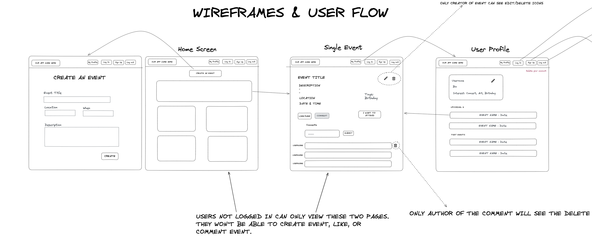

# eventMate

## Description

The main goal of this project was to work as a team to create a full MERN stack application. It was our third project on the course and our first time working collaboratively as a group. 

## Deployment Link

[Deployment Link](https://eventmate.netlify.app/)

## Timeframe & Working Team 

The group included Michela Bicocchi, Miles Morris, Catherine Nevin and myself. The project gave us the opportunity to contribute as a group, in pairs and individually over the course of a week.

## Technologies Used

* Trello
* Excalidraw
* VS Code
* React JS
* Mongoose
* Heroku
* MongoDB
* Express
* Github

## Brief

One of the aims of this project was to build a fully functioning full stack application against a set of technical requirements. However, the main aim of this project was to work as a team to build an app. We needed to set up a project repo in Github and make frequent commits, pulls and merges. In this way we simulated what it would be like to work in a real life company and hence learned how to work effectively with other people in publishing code and also fixing errors.


## Planning

The project began with an essential part of the project: picking a team name. After lots of ideas being thrown around, we eventually decided upon The Full Stack Squad.

The group then went straight into discussions about what the application would include and what kind of user interactions we were hoping for. A document was created in which the team expectations were set. Each member offered up their strengths and shared personal challenges that they wanted to work on. It was agreed that planning, functional code and excellent communication were essential to working as a group for the project.

We created a collaborative Excalidraw document which could be worked on together in real time and produced wireframes for each page of the application. The document also includes an Entity Relationship Diagram for the Schemas, a data flow diagram between the frontend and backend of the application, layout of the expected react components and user stories.

### Wireframes

 

### ERD


This is what our schema looked like before we started building anything.
Link here
However, this changed when we started connecting our front end APIs to our back end routes. We realised that the concept of a comment only exists as part of an event. Therefore we decided to get rid of the comments model but keep the schema and have it embedded as part of the Events model.

### User Stories


Trello was used as our project management tool and was a fundamental tool in the success of the project. Tickets were initially created for larger tasks and broken down within them. As the project progressed, tasks were added to the ‘to do’ list as the team agreed on what features needed to be added and any bugs that needed fixing. If a team member wanted to focus on a specific task they could allocate themselves to it. As and when each person completed a task, they would check the group Trello Board and select one of the outstanding tasks.

Having discussed our strengths and what hurdles each person wanted to overcome, and keeping communication open throughout the week, meant each time a new task was due to be started, we were able to agree on who should take on what and whether it could be group or paired work between a person who was confident in the task, and one who wanted to improve in that area.

## Build/Code Process

I was able to set up dynamic routing on each individual event card on the homepage so that when the card is clicked the user is navigated to that single event page. This is done by using useParams from react router dom. The id of the event is passed in the URL, then on the event page the URL is grabbed from the URL and stored within a variable so it can be used within an API call.

```js
const { id } = useParams()

const getEvent = () => {
getOneEvent(id)
.then((event) => event.json())
.then((data) => {
setSingleEvent(data.event)
setIsAttending(data.event.attendees.includes(getPayloadFromToken().userId))
})
.catch((error) => console.log(error.message))
}
```

This allows each event page to be loaded with the relevant event information.

I also developed the createOneComment function which creates a comment. It calls an api function called createComment which requires the event id and the text of the comment as arguments which will be sent to the back end. The id is needed as the comment has to be attached to a particular event. Then on the back end the comment is created using the text sent and then the event the comment is attached to is sent as a response to the front end. This is then used to reset the state called singleEvent which is the main state for the single event page. The list of comments is taken from this state so when the state changes the list of comments is updated to show the new comment. The state handling the inputs is also reset for better user experience.

```js
const createOneComment = () => {
createComment(id, newCommentInput)
.then((response) => response.json())
.then((result) => {

setSingleEvent(result)
setNewCommentInput({ ...newCommentInput, text: "", hideAuthor: false })
})
.catch((error) => console.log(error.message))
}
```

I wanted users to have the option to post anonymously on events. To do this first I make sure there is a valid JWT in local storage and it hasn’t expired. Then I compare the author of the comment with the username that we got from the payload of the JWT. If they match I check for if the key within the comment called hideAuthor is true or false. If it is true it will display Anonymous (You) so the user knows it is anonymous but also can identify it as their own comment. If it is not true it will simply display the current user’s username with (You) next to it to once again emphasise it is the current user's comment. Now if the comment username did not match the payload username then the same would happen as above except (You) would not display and the relevant username would display instead of the current users.

```js
{tokenExp() && <p id="author"> {singleComment.author === `${payload.username}` ?
(singleComment.hideAuthor ?
`Anonymous (You)` : `${singleComment.author} (You)`
) : (singleComment.hideAuthor ?
`Anonymous` : singleComment.author
)
} </p>}
```

I came up with the idea to store all the token logic functions and store them in a separate file and then import the functions where they were needed. This was especially helpful with the function to check whether there was still a valid token in local storage.
The get payload function simply grabs the payload from the JWT and decrypts it. 
The tokenExp function stores the payload in a variable to see if there was a payload or not. Then it compares the token expiry time to the current time and if the current time is later then returns false otherwise it returns true.

```js
function getPayloadFromToken() {
const loadedToken = loadToken()
if (!loadedToken) {
return false
}
const encryptedPayload = loadedToken.split('.')
return JSON.parse(window.atob(encryptedPayload[1]))
}	

function tokenExp() {
const payload = getPayloadFromToken()
if (!payload) return false
const now = Math.round(Date.now() / 1000)
return now < payload.exp
}
```

The tokenExp function was really useful when it came to limiting users from accessing certain features when they were not logged in. There were a lot of bugs we were encountering by having the links to certain pages even when a user wasn’t logged in. Initially we wanted to stop them from using the buttons but I thought instead of trying to make the buttons useless we could just not show the buttons if there was not a valid token. I used the tokenExp as a switch. If it came back as true, one navbar would show, however, if it came back as false an alternative navbar would show with just login and signup.

## Challenges

I had some initial difficulty in having the comments appear immediately in the comments list when they are created. Eventually I solved the issue by changing the response received from the backend. This enabled me to set the state where the comments list derived from with what was being received from the backend which would update what appeared on the page.

No one on the team had implemented a working authentication system before and no one was especially confident on the topic. The decision was made to tackle this as a team as everyone needed to explain the process as part of the project requirements and it was an important topic for us all to learn. I personally spent a lot of time researching the process and using a practice project so I could take lead during the implementation of authentication.

It was our first time using Github as a group which adds the extra complexity of multiple people working on the same project and merging conflicts. Merging conflicts caused numerous headaches in the early stages of the project. It took some getting used to but by the end of the project I felt a lot more confident handling merging our different branches and dealing with merge conflicts.

## Wins

* I feel a lot more comfortable using React. I feel more practice and consulting with my team on problems helped me improve my skills.

* I feel we functioned well as a team supporting each other and working to our common goal. If someone in the team was stuck there was always someone able and willing to help them out. 

* It was my first time using Github within a team and to begin with I wasn’t very confident with the process. But, by the end of the project the whole merging process felt like second nature.

* I didn’t understand the authentication process to begin with. I spent time researching the process and am happy that I was able to take the lead on the authentication process. The authentication process also works which is a win.

* First time using a backend on a project and I feel it works well and is a success.

* I figured out how to extract the payload from the Json Web Token which was incredibly useful in the project as it allowed us to store it within local storage and then when we needed the current user’s information we just needed to grab the information from local storage.

## Key Learnings/Takeaways

* If you want to implement authentication it is best to tackle it early. 

* Working in a team adds a different layer of complexity where big decisions need to be tackled together and not necessarily an individual doing what they want.

* Communication is key to prevent two people working on the same feature.

* Having a robust well thought plan helps keep the project on track towards the MVP without getting distracted by additional non essential features.

## Bugs

* The only bug that I am aware of is if a user creates an event and that same user deletes their account the event will remain despite the creator no longer being on the platform.

## Future Improvements

* I want to fix the bug stated above so that when a user is deleted all events they have created are also deleted.

* I want to allow users to see who is attending an event, right now there is only a counter showing how many people are going. 

* I want users to be able to add an icon to their profile so I want to add an image upload feature.

* I want to create a feature where a user can save an event so it is easier to find without having to click the attend button.
